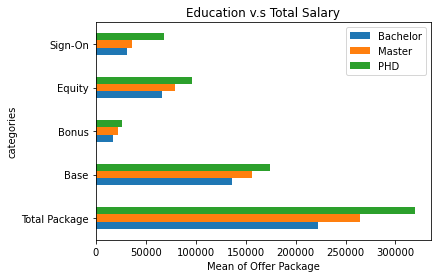

#### Xuan Ji & Ayuan Zhao's Final Project DAMG 6105

## Analysis for Offer Packages of Different Jobs in Tech 2021

--------------This is thoughts of analysis—-------------

### Analyze the offer packages of different jobs in tech 2021.

1.  The composition of income  
Expected to be a pie chart:  Base, Equality(3 or 4 years), bonus, sign-on

2. The composition of jobs  
Expected to be a pie chart: Software Enginner, Machine Learning Engineer, Data Science...

3. The mean/median/std of total income.  
Expected to be a table 

4. Area comparison chart  
Areas included: Bay Area, Seattle, New York, Boston, Texas, Canada, Other Area  
Expected to be a map

5. Job comparison chart  
Jobs included: Mean of Software Engineer, mean of Data Scientist, mean of Machine Learning.  
Expected to be a bar chart

6. Working Experience v.s. Salary  
Expected to be a line chart, scattered dots

7. Education Background v.s Salary 
Education background: BS, MS, PHD  (mean/ median of each category salary)  
Expected to be a bar chart

Another analysis of Total, Base, Bonus, Equity, and Sign-on.  
(Currently only Total and Base, will add more)  

Maybe it can be a 3D chart? Education background vs Working experience vs Salary? 

8. Different range of total income may result in different ratio of Base/Bonus/Equity/Sign-on  
Excepted to be 3 pie charts with 3 ranges of total income 
- 0 - 200k  
- 200k - 400k  
- 400k +

9. New Grad  return offer vs normal  
The comparison between return offer and normal. Will the employees who were interned in the company be offered a higher salary?  
Expected to be a dot chart

Best offer companies vs lowest offer companies for new grad(top 5 vs bottom 5)  
Expected to be a bar chart

10. What are the common traits of the 5% of the highest paid?  
Expected to be key words bubble.

